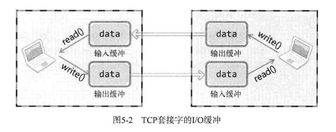

# TCP/IP
## 四层协议
- 链路层    :主要是物理层，如路由器，交换机
- IP层      :主要解决传输路径选择的问题
- TCP/UDP层 :主要是进行数据在IP层的基础上进行数据传输，也称传输层
- 应用层    :...

## TCP-IO缓冲区
TCP套接字的收发没有边界，服务端即使调用1次write函数传输40字节的数据，客户端也有可能通过4次read函数调用每次读取10字节。实际上，read函数并非马上读取，write函数也并非马上写入；而是write函数调用的瞬间，数据被移至输出缓冲区；read函数调用瞬间，从输入缓冲区读取数据。

### IO缓冲区的特性
- I/O缓冲在每个TCP套接字中单独存在
- I/O缓冲在创建套接字时自动生成
- 即使关闭套接字，也会继续传递输出缓冲区中遗留的数据
- 关闭套接字将丢失输入缓冲区的数据
