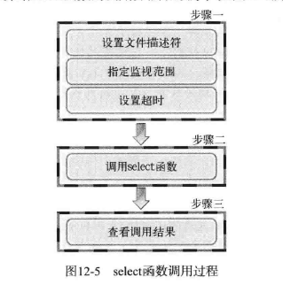

# select 

## 调用方法和顺序


### 1.设置文件描述符
- 承载文件描述符的结构体 struct fd_set，
- 设置文件描述符的宏
    - FD_ZERO(fd_set* fdset), 将fd_set 变量的所有位初始化为0
    - FD_SET(int fd , fd_set *fdset), 在参数fd_set的变量fdset中注册文件描述符fd的信息
    - FD_CLR(int fd , fd_set *fdset), 从参数fd_set的变量fdset中清除文件描述符fd的信息
    - FD_ISSET(int fd , fd_set *fdset), 若参数fdset指向的变量中包含我呢见描述符fd的信息，则返回真
```
#include <stdio.h>
#include <sys/select.h>
#include <sys/types.h>

int main()
{
    printf("Hello world\n");
    fd_set fs;
    FD_ZERO(&fs);
    FD_SET(1 , &fs);
    FD_SET(2 , &fs);
    FD_CLR(1 , &fs);
    printf("1 is set to fdset , %d\n" , FD_ISSET(1 , &fs));
    printf("2 is set to fdset , %d\n" , FD_ISSET(2 , &fs));
    return 0;

}
```
### 2.设置检查（监视）范围及超时
> 先看下select函数
```
#include <sys/select.h>
#include <sys/time.h>
#include <sys/types.h>
#include <unistd.h>

int select(int nfds, fd_set *readfds, fd_set *writefds,fd_set *exceptfds, struct timeval *timeout);
```
    - nfds      监视对象文件描述符的数量
    - readfds   将所有关注"是否存在待读取数据" 的文件描述符注册到fd_set型变量，并传递其地址值
    - writefds  将所有关注"是否可传输无阻塞数据"的文件描述符注册到fd_set型变量，并传递其地址值
    - exceptfds 将所有关注"是否发生异常" 的文件描述符注册到fd_set型变量，并传递其地址值
    - timeout   调用select 后为防止陷入无限阻塞的状态，传递超时(time-out)信息
    - 返回值    发生错误时返回-1，超时返回0。因发生的事件返回时，返回事件的文件描述符.

#### 设置监视范围
参数-nfds,

#### 设置超时时间
```
struct timeval{
    long tv_sec;    //seconds
    long tv_usec;   //microseconds
}
```
### 3.调用select
> 调用demo
```
#include <sys/select.h>
#include <sys/time.h>
#include <unistd.h>


#define BUF_SIZE 1024
int main()
{
    fd_set reads , temps;
    struct timeval timeout;

    int result , str_len;
    char buf[BUF_SIZE];

    FD_ZERO(&reads);
    FD_SET(0 , &reads);

    while(1){
        temps = reads;
        timeout.tv_sec = 5;
        timeout.tv_usec = 0;

        result = select(1 , &reads , NULL , NULL , &timeout); 
        if(result == -1){
            puts("select() error!");
            break;

        }
        else if(result == 0){
            puts("time-out !");

        }
        else{
            if(FD_ISSET(0 , &temps))
            {
                str_len = read(0 , buf , BUF_SIZE);
                buf[str_len] = 0;
                printf("message from console: %s" , buf);
            }
        }
    }
    return 0;
}
```
